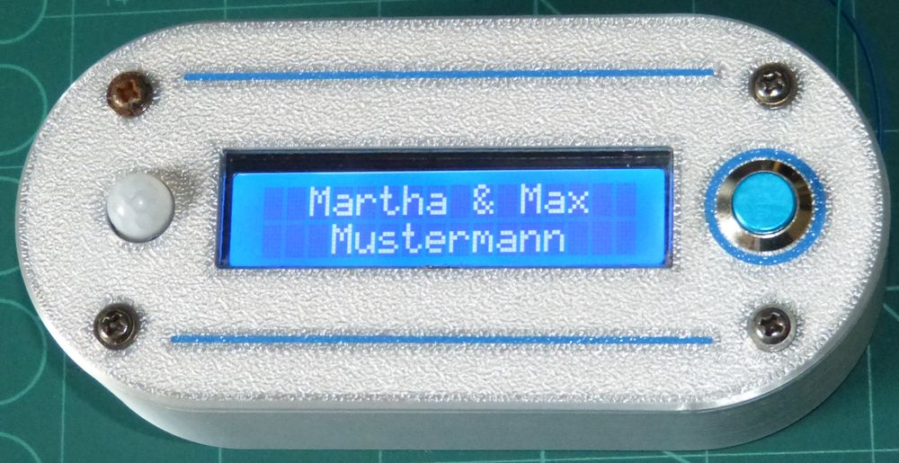

# Klingel 2

Dieses Projekt realisiert ein elektronisches Klingelschild, mittels ATmega48 und einem HD44780 1602. Auf zwei Pages werden zunächst ein Willkommensgruß und nach einer gewissen Verzögerung, der Name angezeigt.
Die Schriftzeichen werden dabei jeweils von links nach rechts eingescrollt. Dieser Vorgang wird bis zur Abschaltung wiederholt. Die Betriebsspannung kann im Bereich zwischen 6...12VAC/DC liegen. Die Zu- bzw. Abschaltung erfolgt über einen kleinen PIR-Bewegungsmelder. Alle Teile werden in einem Kunstoffgehäuse, bestehend aus 3D-Druckteilen, eingebaut und mit einem Klingelknopf komplettiert.
Eine ausführliche Beschreibung und die kompletten Bauunterlagen des Projekts, sind auf meiner Website [Eltguy.de](https://eltguy.de/selbstbauprojekte-elektronik-technik-hobbytechnologien/haustuerklingel/) zu finden.

## Lizenzierung

Die Firmware wird unter MIT-Lizenz veröffentlicht.

Das gesamte dazugehörige Elektronik-Design, insbesondere die elektronische Schaltung und die Leiterplatte, ist mein geistiges Eigentum. Diese Teile dürfen ausschließlich für private Anwendungen gebaut und verwendet werden. Ich gestatte auch die Nutzung der bereitgestellten Entwicklungsunterlagen, die ich zum Download anbiete. Eine kommerzielle Nutzung schließe ich definitiv aus! Es ist nicht gestattet, Kennzeichnungen, die auf den geistigen Ursprung der Projekte hinweisen (Copyrights, Logos, Namen,…) aus Entwicklungsunterlagen der Anlage und Anlagenteilen zu entfernen. Nachbau und Nutzung erfolgen auf eigenes Risiko. Ich hafte nicht für Schäden, die durch die Nutzung der Software, der Anlage oder Anlagenkomponenten entstehen.

